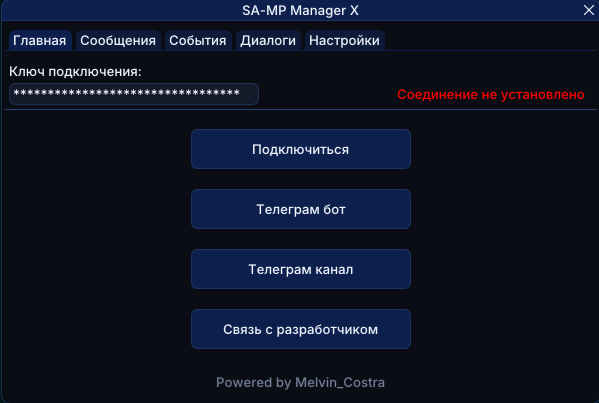

# 📲 SA-MP Manager X | Скрипт для обмена сообщениями между SA-MP и Telegram-ботом

Скрипт, который связывает SA-MP с Telegram через вебсокет. Все важные события из игры прилетают вам в бот, а сообщения из бота можно отправлять прямо в игру — больше не нужно держать GTA открытой перед глазами весь день.

## 📥 [**Скачать script.zip**](https://github.com/melvin-costra/sampmanagerx/releases/latest/download/script.zip)

> После скачивания перенеси файлы из архива в папку `moonloader`.

  

---

## ✨ Что умеет:
- Присылает в Telegram игровые сообщения по тегам (админ, саппорт, рация, РП-чат, СМС, зарплата и т.д.) — сами выбираете, что важно, а что не нужно
- Присылает события: смерть, урон (нанесённый/полученный, с указанием оружия и части тела), телепорт с указанием зоны на карте, изменение уровня розыска, изменение виртов, изменение хп и брони, смену скина, анимации, смену интерьера, спецдействия (наручники, джетпак, телефон и т.д.), текст на экране (GameText), заморозку/разморозку администратором, появление/исчезновение игроков в зоне стрима, разрыв соединения с сервером
- Присылает игровые диалоги (меню, списки, ввод текста, пароль) — отвечаете прямо из Telegram, и ответ улетает обратно в игру
- Можно отправлять сообщения и команды из бота напрямую в чат игры — пишете боту, оно появляется у вас в SA-MP. После отправки ответ из игрового чата какое-то время пересылается обратно в бот
- Гибкие настройки подключения: автоподключение при входе в игру, автоматическое переподключение при потере соединения с настраиваемым числом попыток и действие при обрыве (уход в АФК или выход из игры)
- Звуковое уведомление в игре при получении сообщения от бота — с регулировкой громкости

---

## 🗂 Конфиги сообщений

Список отслеживаемых сообщений больше не зашит в скрипт — он лежит в отдельных JSON-файлах в папке `moonloader/config/sampmanagerx/messages`. Благодаря этому можно держать несколько наборов правил (например, под разные сервера) и переключаться между ними прямо в игре.

- `имя.default.json` — **шаблон** (эталон). Из него создаётся рабочий конфиг, к нему же возвращает кнопка **Сброс**
- `имя.json` — **рабочий конфиг**, в него сохраняются все ваши правки

В комплекте идёт готовый шаблон `samp-rp.default.json`.

На вкладке **Сообщения** можно:
- Выбрать активный конфиг в выпадающем списке (или не выбирать ни одного — тогда сообщения из чата не пересылаются)
- **Создать** новый конфиг — пустой или клоном текущего
- **Переименовать** и **удалить** конфиг или его шаблон
- Сохранить текущий конфиг как **шаблон**
- Обновить конфиг, если в шаблоне появилась новая версия — скрипт сам заметит это и предложит кнопку **Обновить**

> ⚠️ Обновление и сброс перезаписывают конфиг значениями из шаблона — правила, добавленные вручную, будут потеряны.

---

## ✏️ Свои сообщения

Правила можно создавать, редактировать и удалять прямо в игре — кнопки **Добавить**, ✏️ и 🗑 на вкладке **Сообщения**.

В форме правила задаются:
- **Тег** (не обязательно) — метка, с которой сообщение уйдёт в бот, до 10 символов
- **Описание** — обязательное, как правило подписано в списке
- **Цвет HEX** (не обязательно) — цвет сообщения в игровом чате, 8 символов, напр. `FFAA00FF`
- **Шаблон** (не обязательно) — Lua-шаблон текста. Доступны подстановки `{NICK}` и `{MY_ID}`
- **Шаблон конца** (не обязательно) — для многострочных сообщений: строка, на которой сбор завершается. Всё между «Шаблоном» и «Шаблоном конца» уйдёт в бот одним сообщением
- Флажки **Включено** и **Уведомления**

Заполнить нужно хотя бы одно из двух — цвет или шаблон.

**Помощники в форме:**
- **Образец из чата** — выпадающий список последних сообщений игрового чата. Выбираете сообщение и сразу видите, совпадает ли ваш шаблон, с подсветкой совпавшего куска
- Кнопка ➕ рядом с цветом образца подставляет его HEX в поле **Цвет HEX**
- Флажок **Шпаргалка по шаблонам** открывает справку по синтаксису Lua-шаблонов с примерами

Если шаблон окажется некорректным, скрипт не упадёт: правило автоматически отключится, а в игровой чат придёт сообщение с его названием.

---

## ⚙️ Как подключить:
1. Вводите команду `/smx` в игре — откроется окно скрипта
2. Идёте в Telegram-бота, пишете команду `/key` — бот выдаст вам ключ подключения
3. Вставляете ключ в поле **Ключ подключения** и жмёте **Подключиться** (кнопка 👁 рядом с полем показывает или прячет ключ)
4. На вкладке **Сообщения** выбираете конфиг и настраиваете, какие сообщения присылать
5. На вкладках **События** и **Диалоги** настраиваете, что присылать и какие уведомления включать
6. На вкладке **Настройки** включаете автоподключение, переподключение при обрыве, звуковые уведомления и другие параметры под себя

> ⓘ Все настройки сохраняются автоматически.

🤖 **Telegram бот**
👉 [@sampmanagerx_bot](https://t.me/sampmanagerx_bot)

---

## ▶ Активация

Используй команду: `/smx`

## 📢 Связь

Подпишись на мой телеграмм канал и будь в курсе обновлений - [@melvin_costra](https://t.me/melvin_costra)
Мой телеграм - [@vovka8101](https://t.me/vovka8101)
