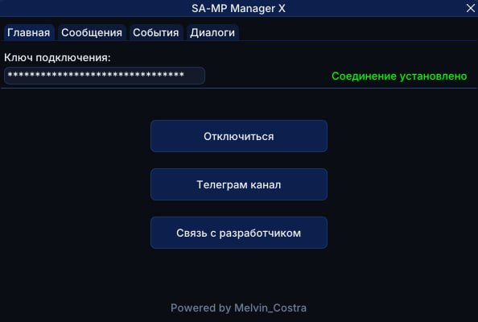
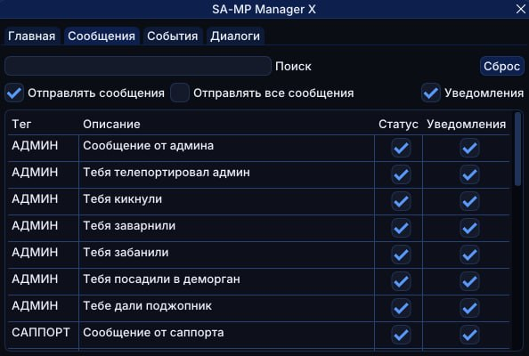
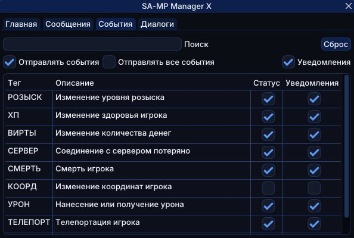
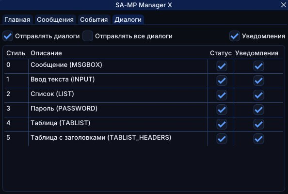

# 📲 SA-MP Manager X | Скрипт для обмена сообщениями между SA-MP и Telegram-ботом

Скрипт, который связывает SA-MP с Telegram через вебсокет. Все важные события из игры прилетают вам в бот, а сообщения из бота можно отправлять прямо в игру — больше не нужно держать GTA открытой перед глазами весь день.

## Скриншоты скрипта

  

  

  

  

---

## ✨ Что умеет:
- Присылает в Telegram игровые сообщения по тегам (админ, саппорт, рация, РП-чат, СМС и т.д.) — сами выбираете, что важно, а что не нужно
- Присылает события: смерть, урон (нанесённый/полученный, с указанием оружия и части тела), телепорт с указанием зоны на карте, изменение уровня розыска, изменение виртов, изменение хп, заморозку/разморозку администратором, разрыв соединения с сервером
- Присылает игровые диалоги (меню, списки, ввод текста, пароль) — отвечаете прямо из Telegram, и ответ улетает обратно в игру
- Можно отправлять сообщения и команды из бота напрямую в чат игры — пишете боту, оно появляется у вас в SA-MP

---

## ⚙️ Как подключить:
1. Вводите команду `/smx` в игре — откроется окно скрипта
2. Идёте в Telegram-бота, пишете команду `/key` — бот выдаст вам ключ подключения
3. Вставляете ключ в поле **Ключ подключения** и жмёте **Подключиться**
4. На вкладках **Сообщения**, **События** и **Диалоги** настраиваете, что присылать и какие уведомления включать

> ⓘ Все настройки сохраняются автоматически.

🤖 **Telegram бот**
👉 [@sampmanagerx_bot](https://t.me/sampmanagerx_bot)

---

## ▶ Активация

Используй команду: `/smx`

## 📢 Связь

Подпишись на мой телеграмм канал и будь в курсе обновлений - [@melvin_costra](https://t.me/melvin_costra)
Мой телеграм - [@vovka8101](https://t.me/vovka8101)
